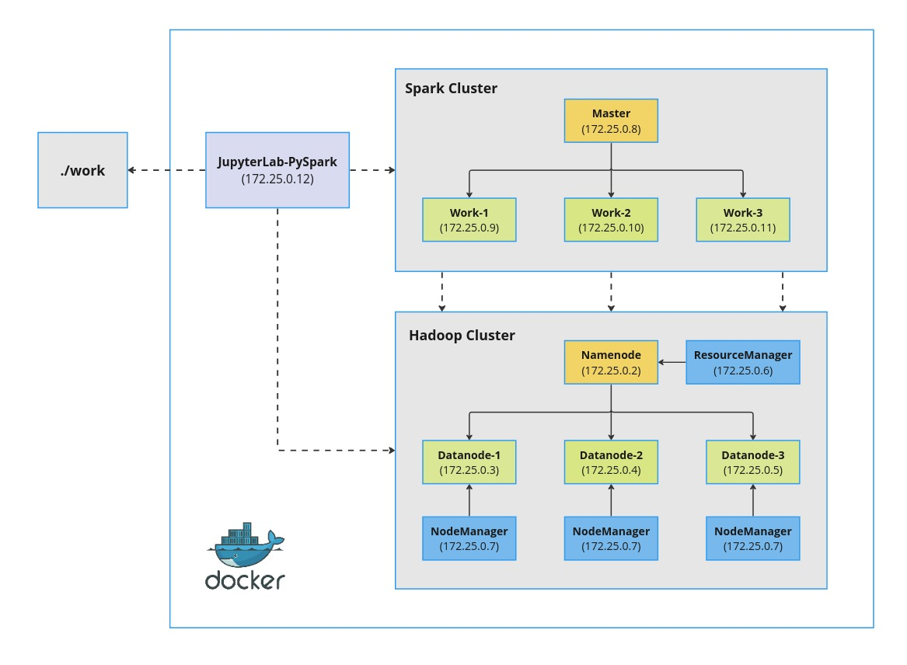
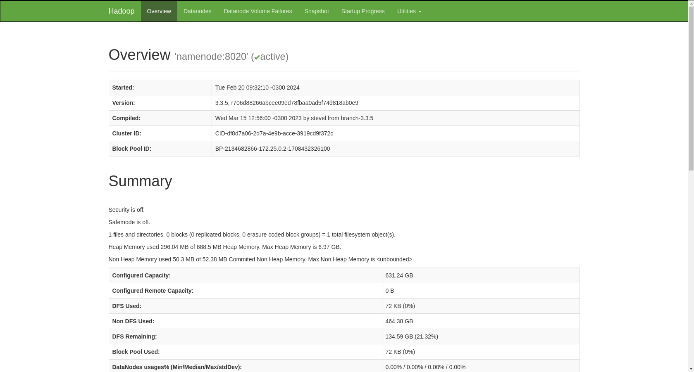
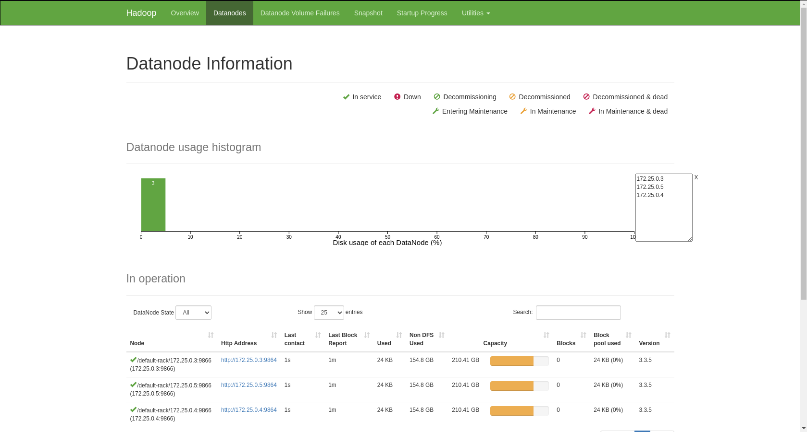
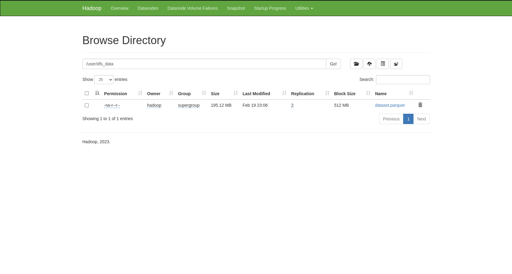
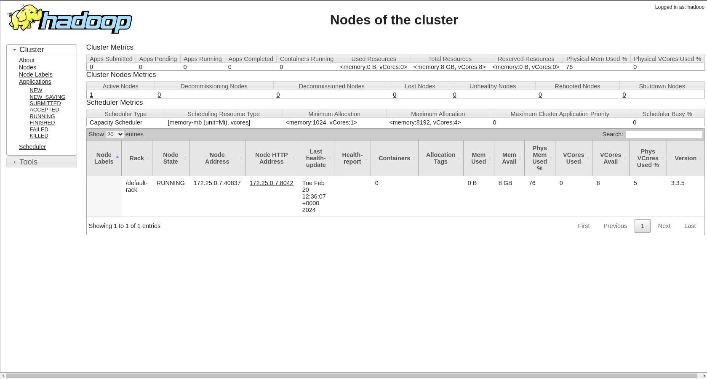
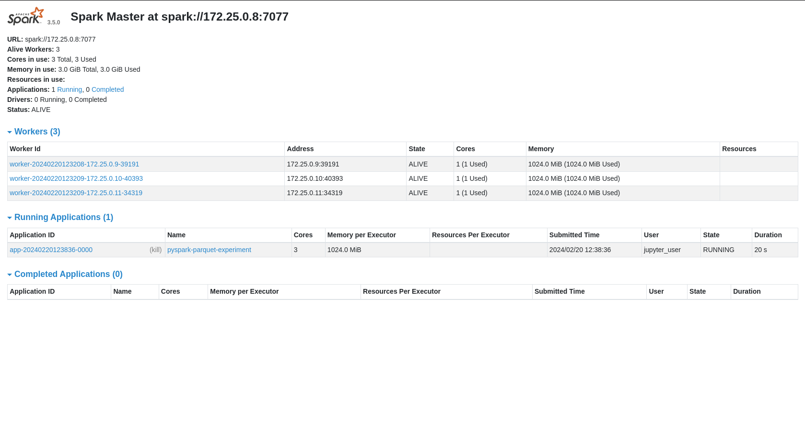
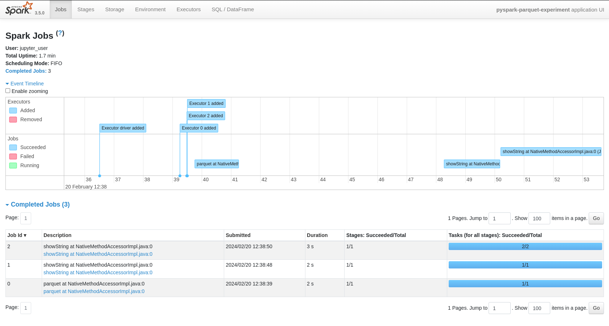

<br/>

# Spark-Hadoop_Local-Docker-Cluster

<br/>

Esse projeto tem o propósito de oferecer um ambiente de desenvolvimento local baseado em Docker, de uma infraestrutura em cluster do Apache Spark integrado ao HDFS do Apache Hadoop. O objetivo é facilitar a criação e a utilização de clusters em modo standalone, sem a necessidade de instalar e configurar toda pilha de cada aplicação, tornando ideal para estudos e experimentos nos ambientes distribuídos do Spark e Hadoop.

<br/>

<h3 align="center">
  
</h3><br />

### Pre-requisitos

- [Docker](https://docs.docker.com/get-docker/)
- [Docker Compose](https://docs.docker.com/compose/install/)
- [Git](https://git-scm.com/book/en/v2/Getting-Started-Installing-Git)
- Pelo menos 16 GB de RAM
- 20 GB de espaço livre em disco
- Ambiente Linux

<br/>

### Utilização

Ativação pelo terminal do Linux:

```
git clone https://github.com/fab2112/Spark-Hadoop_Local-Docker-Cluster.git
```

```
cd Spark-Hadoop_Local-Docker-Cluster
```

```
docker-compose up --build -d
```

Desativação:

```
docker-compose down
```

<br/>

### Interfaces WEB Operacionais

Acessar pelo navegador:

| Aplicação             | URL                                       | Descrição                                      |
| ----------------------- | ----------------------------------------- | ------------------------------------------------ |
| JupyterLab-PySpark      | [172.25.0.12:8888](http://172.25.0.12:8888/) | Interface Jupyter notebook com PySpark integrado |
| Spark Master            | [172.25.0.8:8080](http://172.25.0.8:8080/)   | Spark Master node                                |
| Spark Master            | [172.25.0.12:4040](http://172.25.0.12:4040/) | Spark UI                                         |
| Spark Worker I          | [172.25.0.9:8081](http://172.25.0.9:8081/)   | Spark Worker node 1                              |
| Spark Worker II         | [172.25.0.10:8081](http://172.25.0.10:8081/) | Spark Worker node 2                              |
| Spark Worker III        | [172.25.0.11:8081](http://172.25.0.11:8081/) | Spark Worker node 3                              |
| Hadoop Namenode         | [172.25.0.2:9870](http://172.25.0.2:9870/)   | Hadoop Namenode 1                                |
| Hadoop Datanode I       | [172.25.0.3:9864](http://172.25.0.3:9864/)   | Hadoop Datanode 1                                |
| Hadoop Datanode II      | [172.25.0.4:9864](http://172.25.0.4:9864/)   | Hadoop Datanode 2                                |
| Hadoop Datanode III     | [172.25.0.5:9864](http://172.25.0.5:9864/)   | Hadoop Datanode 3                                |
| Hadoop Resource Manager | [172.25.0.6:8088](http://172.25.0.6:8088/)   | Hadoop ResourceManager                           |

<br/>

### Ecossistema

- Infraestrutura

| Componente     | Versão  |
| -------------- | -------- |
| Docker Engine  | 20.10.0+ |
| Docker Compose | 1.29.0+  |

- Languagens e aplicações

| Spark | Hadoop | Scala   | Python |
| ----- | ------ | ------- | ------ |
| 3.5.0 | 3.3.5  | 2.12.18 | 3.11.8 |

- Imagens docker

| App           | Docker Tag                      |
| ------------- | ------------------------------- |
| Apache Spark  | bitnami/spark:3.5.0             |
| Apache Hadoop | apache/hadoop:3.3.5             |
| JupyterLab    | jupyter/pyspark-notebook:latest |

<br/>

### Screenshots

- Hadoop Namenode: 172.25.0.2:9870

<h3 align="center">
  
</h3><br />

- Hadoop Datanode: 172.25.0.2:9870

<h3 align="center">
  
</h3><br />

- Hadoop HDFS: 172.25.0.2:9870

<h3 align="center">
  
</h3><br />

- Hadoop Resource Manager: 172.25.0.6:8088

<h3 align="center">
  
</h3><br />

- Spark Master: 172.25.0.8:8080

<h3 align="center">
  
</h3><br />

- Spark UI: 172.25.0.12:4040

<h3 align="center">
  
</h3><br />

## License

[MIT](https://choosealicense.com/licenses/mit/)

<br/>
